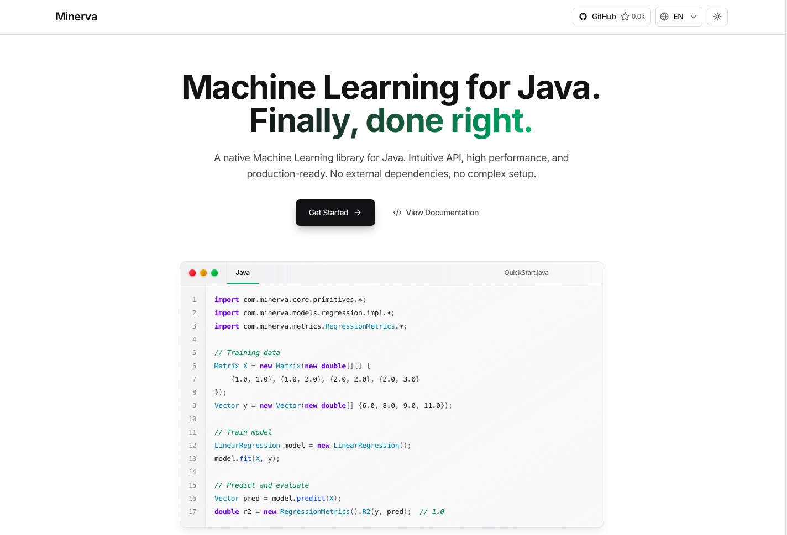

<div align="center">

# Minerva

**High-performance Machine Learning library for Java.**

Pure Java. Zero dependencies. Production ready.

---



[Documentation](https://minerva-docs.vercel.app)

</div>

## Quick Start

```java
import com.minerva.core.primitives.Matrix;
import com.minerva.core.primitives.Vector;

// Solve a linear system Ax = b
Matrix A = new Matrix(new double[][]{{2, 3}, {4, 1}});
Vector b = new Vector(new double[]{8, 6});

Vector x = A.solve(b);  // x = [1, 2]
```

## Examples

**Matrix operations**
```java
Matrix A = new Matrix(new double[][]{{1, 2}, {3, 4}});
Matrix B = new Matrix(new double[][]{{5, 6}, {7, 8}});

Matrix C = A.multiply(B);
Matrix T = A.transpose();
Matrix I = Matrix.identity(3);
```

**Linear regression**
```java
LinearRegression model = new LinearRegression();
model.fit(X, y);
Vector predictions = model.predict(XTest);
```